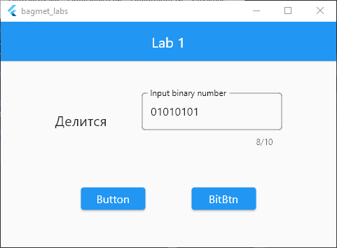
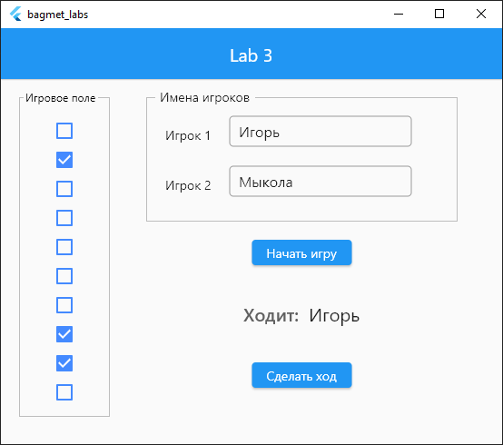

# Labs

1. Число вводится своим двоичным представлением (длина числа не превышает 10 двоичных разрядов).   Необходимо определить делится ли число на 5

  
  

  

2. Создать программу, выполняющую конвертацию валют (все данные вводятся вручную)

   
  

   

3. Создать игру «Спички». На стол кладется 10 спичек.  Ребята по очереди берут их со стола, причем за один ход разрешается взять 1, 2 или 3 спички.   Выигрывает тот, кто возьмет последнюю спичку.
 

